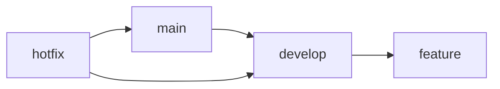

# Tamplate of repository

> [!WARNING]
> You need to make edits to this repository in order to continue working correctly

## Fix first commit

### Use Makefile

```bash
make init
```

### Use git command

```bash
git update-ref -d HEAD
git add .
git commit -m 'init: create repository'
git push --force
```

## Gitflow


